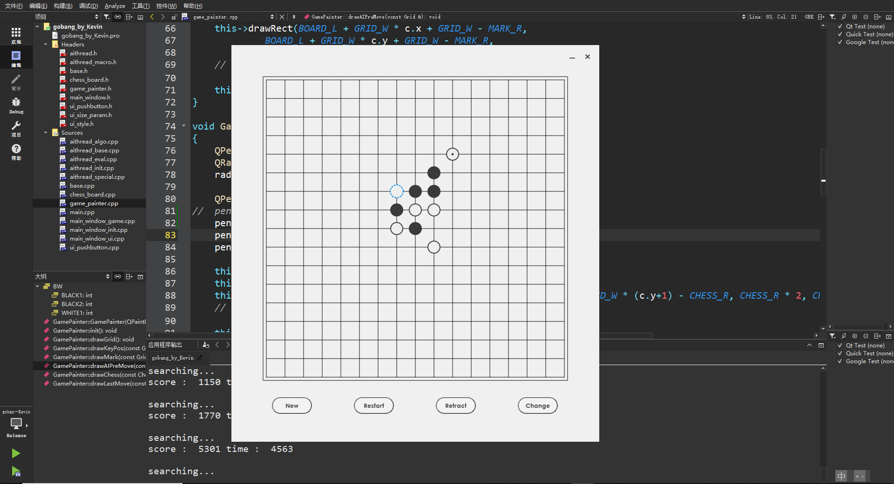

# Gobang_by_Kevin

# 简介

通过 Qt 5.11.1 (C++11) 开发，AI最大搜索深度 12，棋力可观

# 体验
Windows环境下，下载.exe文件可直接体验，通过鼠标操作：
- 落子：鼠标直接点击（待落子点有提示标记）
- 与AI对弈时切换先后手并重新开始游戏：new 按钮
- 重新开始游戏：restart 按钮
- 悔棋：retract 按钮
- 切换人机对弈模式与人人对弈模式：change 按钮

# 涉及算法与模块

- 状态压缩
- 极大极小搜索 + alpha-beta 剪枝 + 特殊剪枝（响应必杀棋）
- A*优化（启发式搜索）
- 迭代加深
- 棋类算杀模块
- 棋型映射表
- Zobrist置换表（testing）
- 多线程
